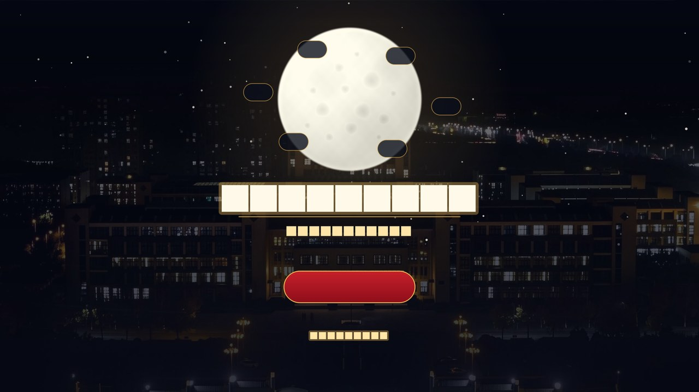
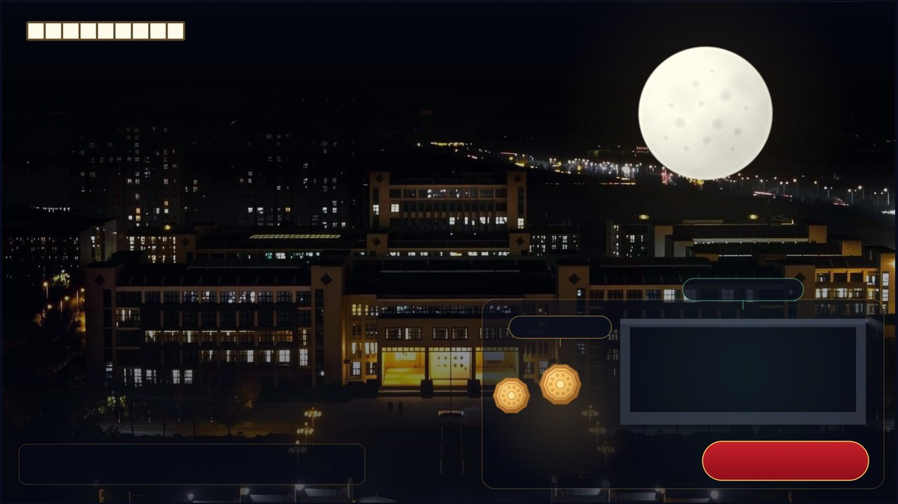
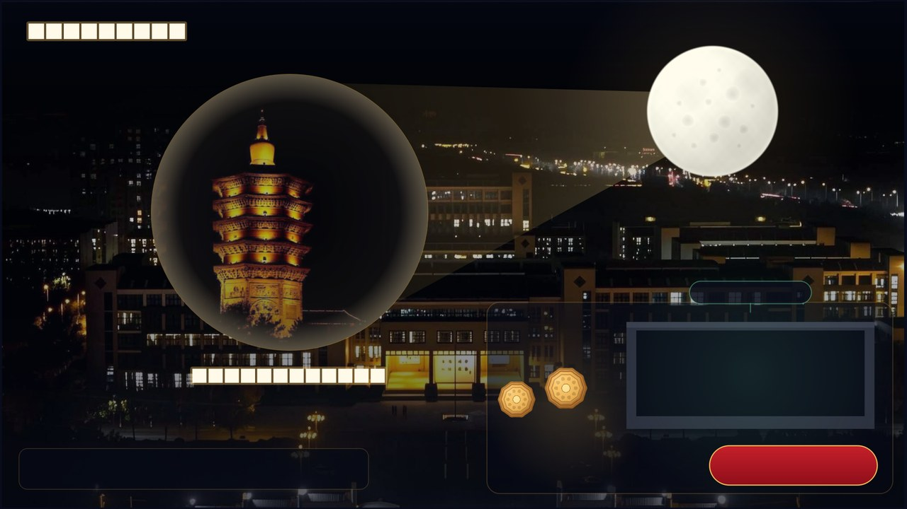
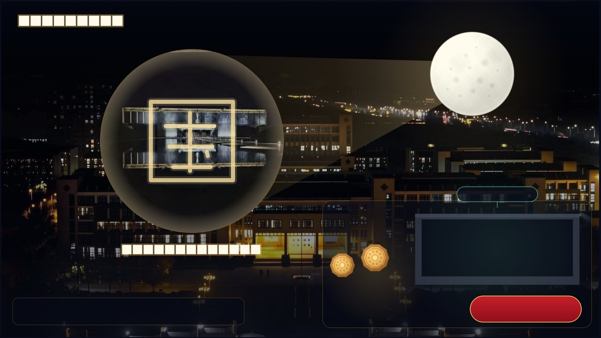
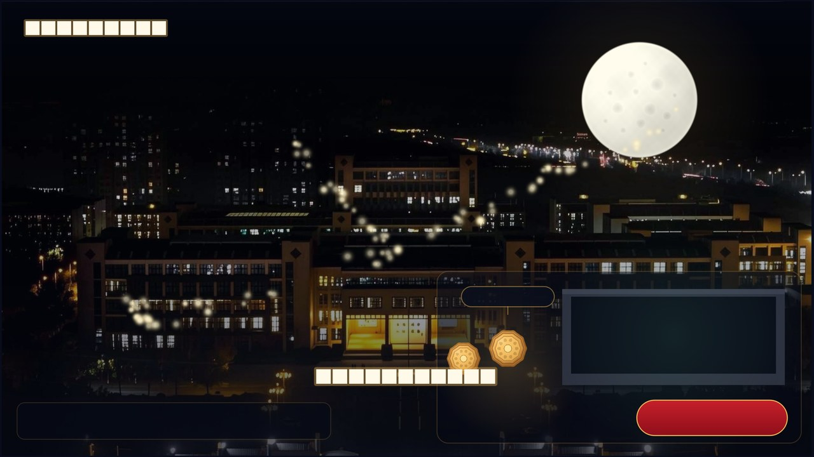
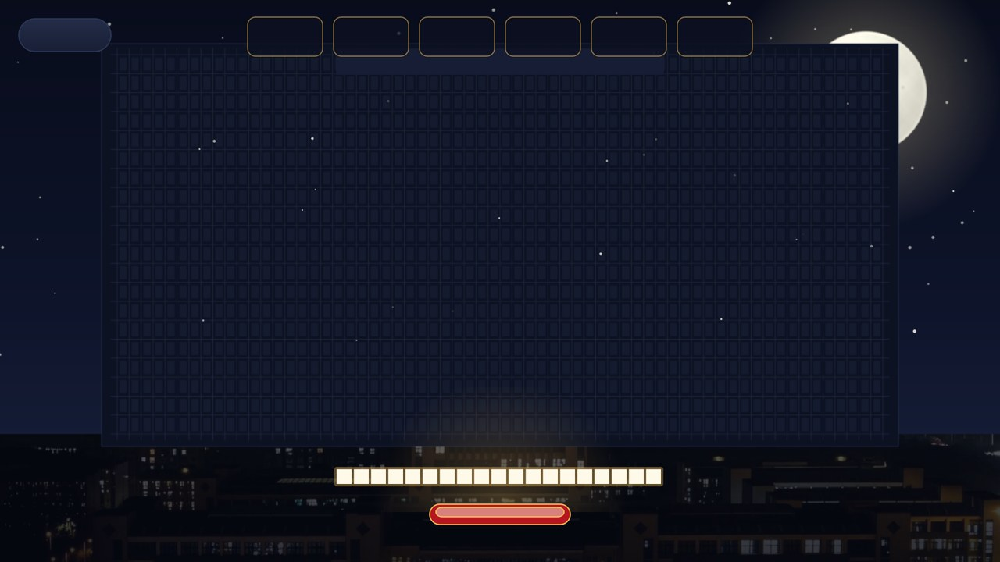
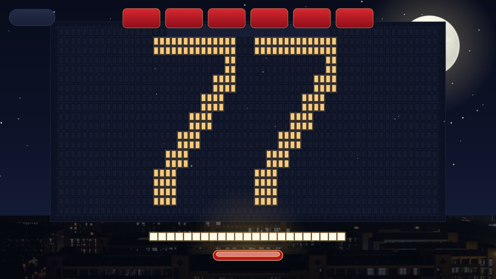
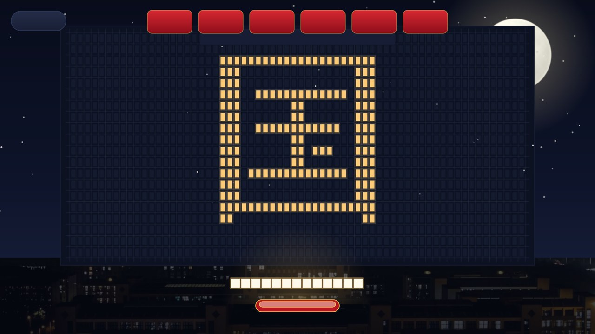
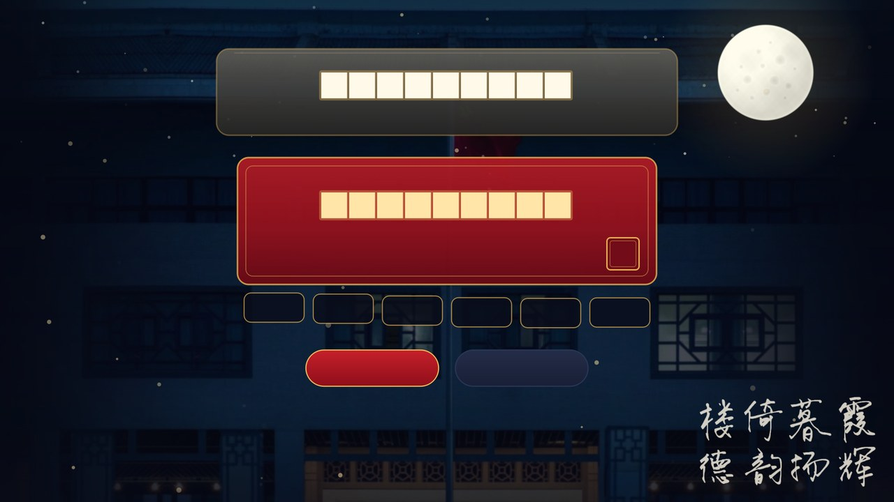

# 月满华诞，码上团圆 · YueManHuaDan

> 活动主题：**代码寄家国，月色赴华章**
> 参赛作品：《月满华诞，码上团圆》　|　河南师范大学 · 软件学院
> 给留校同学的双节礼物：把小家的思念，写进大家的代码里。
> 安阳（甲骨文故乡）× 软件学院 × 国庆七十七华诞 —— 一个可以「点、拖、玩」的 Qt 桌面交互程序。

## 一、作品立意

中秋与国庆临近，许多同学因学习、路途留校。留校不是缺席团圆，而是把小家的思念放进软件学院这个「大家」里，用代码连接家乡与祖国。

作品用三段式互动完成这个表达：

| 环节 | 交互 | 表达 |
| --- | --- | --- |
| 主场景 | 软件学院**实拍夜景**铺满全屏，实验室窗户亮着，桌上有月饼和电脑 | 留校的日常被看见 |
| 小家团圆 | **点击月饼** → 月亮像投影仪一样，在圆幕上投出安阳文峰塔、甲骨文「家」「国」、家乡小院 | 千里之外的家被照亮 |
| 大家昌盛 | **点击电脑** → 代码字符化作金色粒子，依次汇成黄河、长城、高铁、航天 | 用代码写下的生日贺礼 |
| 场景切换 | **拖动月亮** → 在「安阳·家 / 甲骨·国 / 校园·团圆」三幕间切换 | 思念可以自由往返 |
| 点亮全楼 | 进入**接月饼小游戏**：接住写有六个词的月饼，每接住一个点亮一扇留校窗户 | 每个人都为全楼添一盏灯 |
| 结尾 | 窗户先拼出「**77**」（国庆七十七华诞），再拼出一个「**国**」；校训石亮起「厚德博学，止于至善」，祝福卡写下「以我代码，贺你华诞」 | 小家团圆，大家昌盛 |

配色为**红 · 金 · 白**，实拍底图加矢量绘制加粒子动画，整体气质温暖、治愈、自豪。

> **关于「国」字**：结尾与游戏中的窗户点阵原本打算拼中国地图轮廓，但用点阵近似国界既画不准、也不符合地图使用规范，
> 因此改为拼一个「国」字 —— 题眼正好落在活动主题「代码寄**家国**，月色赴华章」上，既稳妥又更贴题。

## 二、画面预览

| 启动页 | 主场景 · 软件学院夜景（实拍） |
| :---: | :---: |
|  |  |

| 点击月饼 · 小家团圆（安阳文峰塔投影） | 拖动月亮 · 家国同庆（甲骨） |
| :---: | :---: |
|  |  |

| 点击电脑 · 代码粒子汇成图景 | 接月饼小游戏 · 点亮留校窗户 |
| :---: | :---: |
|  |  |

| 游戏终局 · 窗户拼出「77」 | 游戏终局 · 万家灯火拼出「国」 |
| :---: | :---: |
|  |  |

| 结尾 · 校训石与祝福卡（校训楼实拍） |
| :---: |
|  |

> 截图由程序自带的演示模式生成：`YueManHuaDan.exe --shots <目录>`（见第六节）。
> 参赛提交的**高清无水印版**（1920×1080 PNG，9 张）在 [`素材效果包/`](素材效果包/)，可直接塞进压缩包。

## 三、技术要点

- **Qt Widgets**（Qt 5.15 / Qt 6 均可编译），纯 C++17，无第三方依赖
- `QGraphicsScene` / `QGraphicsView`：主场景的场景管理与等比缩放
- `QTimer`：60 帧动画主循环
- `QMouseEvent`：鼠标接月饼、拖拽月亮、点击交互
- `QVector<Mooncake>`：下落月饼集合
- `QRectF::intersects()`：月饼与托盘的碰撞检测
- `QPropertyAnimation`：月亮升起与光晕变化
- `QSoundEffect`：可选音效（默认关闭，见 `soundfx.h` 注释）
- `windeployqt`：一键打包 exe 与依赖 dll
- `QPixmap` 实拍底图叠加 + `QPainter` 矢量补绘：照片负责质感，矢量负责可控

**素材分两类，缺一不可，但都能降级：**

1. **程序化素材**（`tools/gen_assets.py` 生成，AI 提示词辅助设计 + 人工调参）
   `moon.png`（月面明暗与环形山）、`mooncake.png`（月饼压花）、`spark.png`、`glow.png`
2. **实拍摄影素材**（`tools/prep_photos.py` 做去水印、转正、画幅重构后入库）
   `school_night.jpg`、`anyang_projection.jpg`、`yinxu_projection.jpg`、`ending_card.jpg`、`ending_motto.png`

> **「丢图即用、缺图回退」**：程序先查 Qt 资源 `:/images/`，再查 exe 同级 `images/`；
> 任何一张图缺失，对应位置都会自动回退到内置矢量稿，画面不会开天窗 —— 保证「拿走就能跑」。

## 四、目录结构

```
YueManHuaDan/
├─ YueManHuaDan.pro           # qmake 工程文件（Qt5/Qt6 通用）
├─ main.cpp                   # 程序入口（含 --shots 演示截图模式）
├─ mainwindow.h/.cpp          # QMainWindow + 启动页（QStackedWidget 页面路由）
├─ nightscene.h/.cpp          # 主场景：夜景 / 月亮投影 / 代码粒子
├─ gamewidget.h/.cpp          # 接月饼小游戏：点亮窗户 → 「77」→ 「国」
├─ endingcard.h/.cpp          # 结尾：校训石 + 祝福卡
├─ soundfx.h/.cpp             # 可选音效开关（默认静音）
├─ theme.h                    # 全局配色 / 字体 / 绘制与素材工具
├─ resources.qrc              # 资源清单（程序化素材 + 实拍素材）
├─ images/                    # 入库素材（已处理，程序直接读取）
│  └─ README.txt              # 素材说明、生成方法与替换指引
├─ photos/                    # 原始照片归档（未处理，仅供追溯来源）
├─ 素材效果包/                 # 参赛提交用运行截图：9 张 1920×1080 PNG
├─ docs/
│  ├─ BUILD.md                # 编译、运行、打包详细说明
│  └─ screenshots/            # README 用效果图（1280×720 JPG）
├─ tools/
│  ├─ gen_assets.py           # 程序化素材生成脚本（纯标准库，无需 Pillow）
│  ├─ prep_photos.py          # 实拍照片预处理（去水印 / 转正 / 画幅重构 / 抠字）
│  ├─ deploy.sh               # 打包脚本（Git Bash / MSYS）
│  └─ deploy.bat              # 打包脚本（Windows 双击 / cmd）
├─ deploy/                    # 打包产物：exe + 依赖 dll，双击即可运行（不提交）
└─ README.md
```

> `deploy/`、zip 包、`upload-ready/` 都已写进 `.gitignore`，不会进入 Git 仓库——
> 提交到 GitHub 的只有源码、素材、文档和脚本。
> 想直接看运行效果又不想自己编译：跑一次 `YueManHuaDan.exe --shots <目录>`（见第六节），
> 或直接看 [`素材效果包/`](素材效果包/) 里现成的高清截图。

## 五、快速开始

```bash
# 0. 前提：Qt 5.15（或 Qt 6）+ 配套 MinGW，并保证 qmake / mingw32-make 在 PATH 里
#    没有 Qt 的话用 aqtinstall 拉一套即可（约 600 MB）：
#    python -m aqt install-qt   -O ./QtEnv windows desktop 5.15.2 win64_mingw81
#    python -m aqt install-tool -O ./QtEnv windows desktop tools_mingw qt.tools.win64_mingw810

# 1. 外部构建（推荐，源码树保持干净）
mkdir build && cd build
qmake ../YueManHuaDan.pro
mingw32-make -j4                 # 用 MSVC 的话是 nmake

# 2. 运行（exe 就落在当前构建目录）
./YueManHuaDan.exe

# 3. 打包成可以直接拷给别人的文件夹
cd ..                            # 回到工程根目录
./tools/deploy.sh                # Git Bash；cmd 下用 tools\deploy.bat
# 产物在 deploy/，双击 deploy/YueManHuaDan.exe 即可运行，目标机器无需安装 Qt
```

也可以直接用 **Qt Creator** 打开 `YueManHuaDan.pro`，按 Ctrl+R 运行。

详细步骤（Qt 安装、qmake 找不到、常见报错、windeployqt 的坑）见 [docs/BUILD.md](docs/BUILD.md)。

## 六、操作速查

| 场景 | 操作 |
| --- | --- |
| 启动页 | 回车 / 空格 / 点「开始」 |
| 主场景 | 点月饼 = 安阳投影；点电脑 = 代码礼成；拖月亮 = 换场景；右下按钮 = 进入小游戏 |
| 小游戏 | 鼠标左右移动接月饼；`R` 重来；`Esc` 返回主场景 |
| 结尾 | `R` 再玩一次；`Esc` 回主场景 |

### 演示截图模式

程序内置了一个「自动演一遍并逐幕截图」的模式，方便做 README、答辩 PPT 或展示海报：

```bash
YueManHuaDan.exe --shots D:/shots
```

它会依次走过「启动页 → 主场景 → 安阳投影 → 甲骨投影 → 代码粒子 → 小游戏(77) → 小游戏(国) → 结尾」，
每一步导出一张 PNG 到指定目录，结束后自动退出。

## 七、素材构成与替换

作品的画面由**实拍底图**和**矢量绘制**两层叠出来：照片负责质感与真实感，矢量负责可控与稳定。
所有入库素材都在 `images/`，替换时把同名文件覆盖进去即可 —— 重新构建走 Qt 资源，
也可以**不重新编译**，直接把图片丢到 exe 同级的 `images/` 目录，程序会优先使用它。

### 实拍摄影素材

| 文件名 | 作用 | 规格 |
| --- | --- | --- |
| `school_night.jpg` | 软件学院夜景，主场景与启动页全屏底图 | 16:9，1920×1080 |
| `anyang_projection.jpg` | 安阳文峰塔夜景，贴进「小家团圆」投影圆幕 | 1:1，1024×1024 |
| `yinxu_projection.jpg` | 殷墟博物馆（甲骨）夜景，贴进「甲骨·国」投影圆幕 | 1:1，512×512 |
| `ending_card.jpg` | 校训楼夜色（国旗 + 立面），结尾页全屏底图 | 16:9，1920×1080 |
| `ending_motto.png` | 原图书法「楼倚暮霞 德韵扬辉」抠字，结尾页书法层 | 透明底 PNG |

原始照片归档在 `photos/`（未处理的原图，仅供追溯来源），处理脚本见 `tools/prep_photos.py`。
**所有入库实拍素材均已去除水印**——文峰塔图底部的水印带在预处理阶段整条裁掉，
殷墟博物馆图正中那道贯穿的「×」形水印用霍夫直线定位后做 inpaint 修补，
程序内也不会叠加任何水印文字。

### 程序化生成素材

| 文件名 | 作用 | 生成方式 |
| --- | --- | --- |
| `moon.png` | 月面明暗、环形山、月海，三处月亮共用 | `tools/gen_assets.py` |
| `mooncake.png` | 月饼压花（十瓣波浪边 + 中央压花） | `tools/gen_assets.py` |
| `spark.png` / `glow.png` | 粒子光点与光晕叠加 | `tools/gen_assets.py` |

```bash
python tools/gen_assets.py        # 重新生成程序化素材（纯标准库，无需 Pillow）
python tools/prep_photos.py       # 从 photos/ 原图重新处理出入库素材（需要 Pillow；去水印与降噪另需 opencv-python）
```

详见 [images/README.txt](images/README.txt)。

## 八、参赛材料清单

按《"代码寄家国，月色赴华章"科创代码活动策划案》要求，提交压缩包内包含：

| 材料 | 位置 |
| --- | --- |
| ① 源代码文件 | 本仓库全部 `.h/.cpp/.pro/.qrc` + `images/` + `tools/` |
| ② 素材效果包（运行截图） | [`素材效果包/`](素材效果包/)　9 张 1920×1080 PNG |
| ③ AI 使用说明文档 | 见仓库根目录 `AI使用说明文档.docx` |
| ④ 创意说明文档（300–600 字） | 见仓库根目录 `创意说明文档.docx` |

压缩包命名：`月满华诞码上团圆+（姓名）+（学号）.zip`

## 九、许可

课程作业 / 参赛作品用途，作者保留署名权。
程序化素材（月亮、月饼、光斑、光晕）由 `tools/gen_assets.py` 生成，可自由使用；
实拍照片为作者本人拍摄，仅本作品使用。
