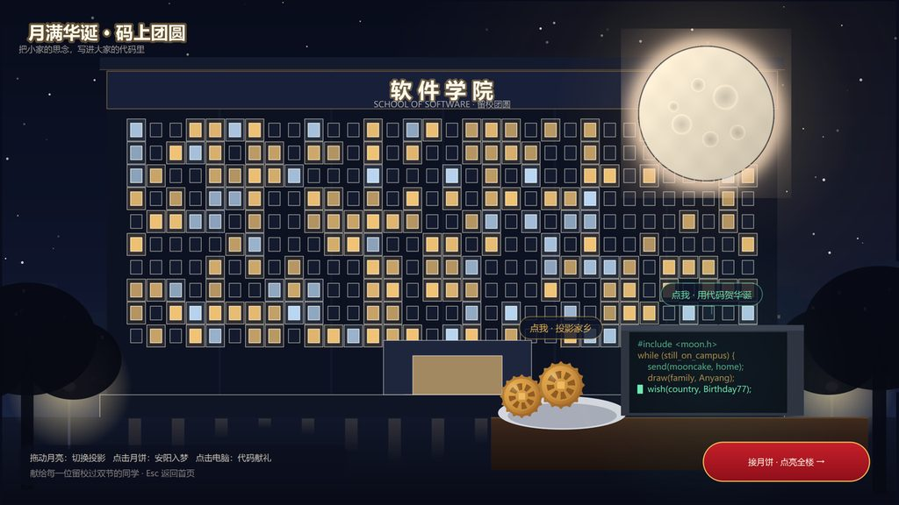
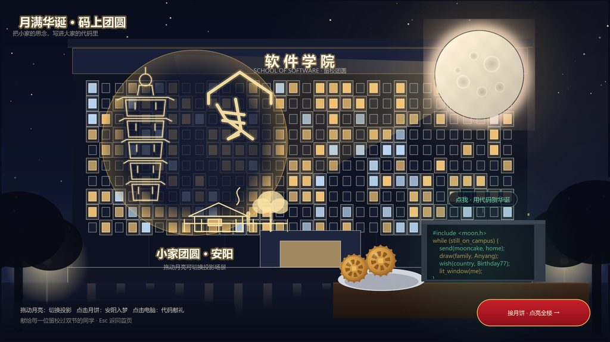
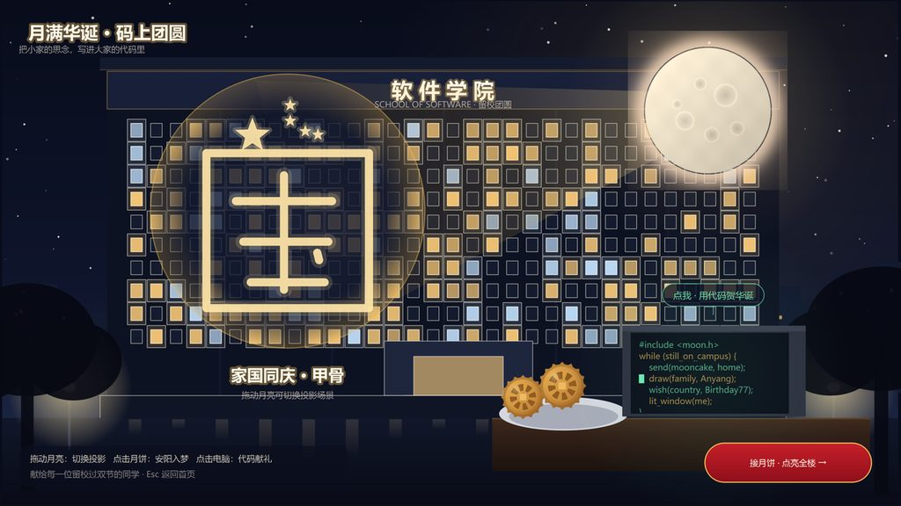
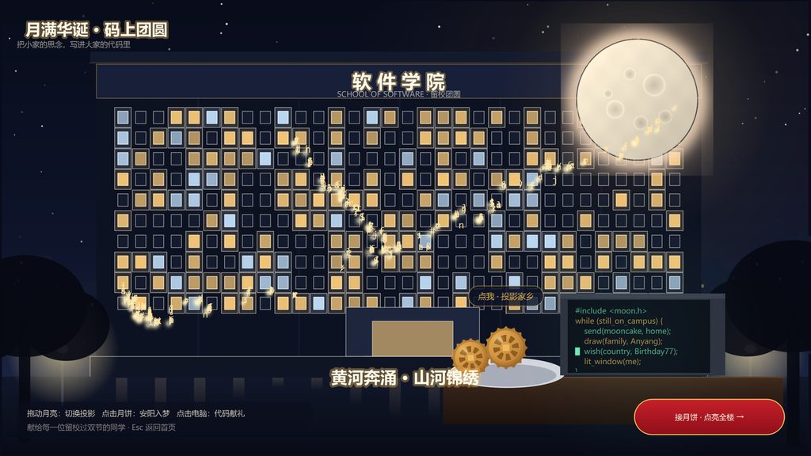
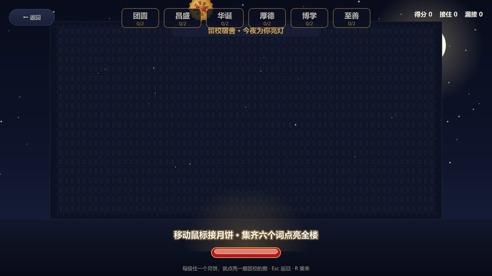

# 月满华诞，码上团圆 · YueManHuaDan

> 给留校同学的双节礼物：把小家的思念，写进大家的代码里。
> 安阳（甲骨文故乡）× 软件学院 × 国庆七十七华诞 —— 一个可以「点、拖、玩」的 Qt 桌面交互程序。

## 一、作品立意

中秋与国庆临近，许多同学因学习、路途留校。留校不是缺席团圆，而是把小家的思念放进软件学院这个「大家」里，用代码连接家乡与祖国。

作品用三段式互动完成这个表达：

| 环节 | 交互 | 表达 |
| --- | --- | --- |
| 主场景 | 软件学院夜景，实验室窗户亮着，桌上有月饼和电脑 | 留校的日常被看见 |
| 小家团圆 | **点击月饼** → 月亮像投影仪一样映出安阳文峰塔、甲骨文「家」「国」、家乡小院 | 千里之外的家被照亮 |
| 大家昌盛 | **点击电脑** → 代码字符化作金色粒子，依次汇成黄河、长城、高铁、航天 | 用代码写下的生日贺礼 |
| 场景切换 | **拖动月亮** → 在「安阳·家 / 甲骨·国 / 校园·团圆」三幕间切换 | 思念可以自由往返 |
| 点亮全楼 | 进入**接月饼小游戏**：接住写有六个词的月饼，每接住一个点亮一扇留校窗户 | 每个人都为全楼添一盏灯 |
| 结尾 | 窗户先拼出「**77**」，再演变为中国地图轮廓；校训石亮起「厚德博学，止于至善」，祝福卡写下「以我代码，贺你华诞」 | 小家团圆，大家昌盛 |

配色为**红 · 金 · 白**，写实底图加粒子动画，整体气质温暖、治愈、自豪。

## 二、画面预览

| 启动页 | 主场景 · 软件学院夜景 |
| :---: | :---: |
|  |  |

| 点击月饼 · 小家团圆（安阳） | 拖动月亮 · 家国同庆（甲骨） |
| :---: | :---: |
|  |  |

| 点击电脑 · 代码粒子汇成图景 | 接月饼小游戏 · 点亮留校窗户 |
| :---: | :---: |
|  |  |

| 结尾 · 校训石与祝福卡 |
| :---: |
|  |

> 以上截图由程序自带的演示模式生成：`YueManHuaDan.exe --shots <目录>`（见第六节）。

## 三、技术要点

- **Qt Widgets**（Qt 5.15 / Qt 6 均可编译），纯 C++17，无第三方依赖
- `QGraphicsScene` / `QGraphicsView`：主场景的场景管理与等比缩放
- `QTimer`：60 帧动画主循环
- `QMouseEvent`：鼠标接月饼、拖拽月亮、点击交互
- `QVector<Mooncake>`：下落月饼集合
- `QRectF::intersects()`：月饼与托盘的碰撞检测
- `QPropertyAnimation`：月亮升起与光晕变化
- `QSoundEffect`：可选音效（默认关闭，见 `soundfx.h` 注释）
- `windeployqt`：一键打包 exe 与依赖 dll

> 所有画面（夜景、文峰塔、甲骨文「家」「国」、长城、高铁、火箭等）均由 `QPainter` 矢量绘制，**不依赖任何外部照片**，缺失素材图片时会自动回退到内置矢量稿，保证「拿走就能跑」。

## 四、目录结构

```
YueManHuaDan/
├─ YueManHuaDan.pro           # qmake 工程文件（Qt5/Qt6 通用）
├─ main.cpp                   # 程序入口（含 --shots 演示截图模式）
├─ mainwindow.h/.cpp          # QMainWindow + 启动页（QStackedWidget 页面路由）
├─ nightscene.h/.cpp          # 主场景：夜景 / 月亮投影 / 代码粒子
├─ gamewidget.h/.cpp          # 接月饼小游戏：点亮窗户 → 77 → 中国地图
├─ endingcard.h/.cpp          # 结尾：校训石 + 祝福卡
├─ soundfx.h/.cpp             # 可选音效开关（默认静音）
├─ theme.h                    # 全局配色 / 字体 / 绘制与素材工具
├─ resources.qrc              # 资源清单（含可选写实素材的开关）
├─ images/                    # 内置素材 + 可选写实素材投放目录
│  └─ README.txt              # 素材说明与替换方法
├─ tools/
│  ├─ gen_assets.py           # 素材生成脚本（纯标准库，无需 Pillow）
│  ├─ deploy.sh               # 打包脚本（Git Bash / MSYS）
│  └─ deploy.bat              # 打包脚本（Windows 双击 / cmd）
├─ docs/
│  ├─ BUILD.md                # 编译、运行、打包详细说明
│  └─ screenshots/            # README 用效果图
├─ deploy/                    # 打包产物：exe + 依赖 dll，双击即可运行（不提交）
└─ README.md
```

> `deploy/`、zip 包、`upload-ready/` 都已写进 `.gitignore`，不会进入 Git 仓库——
> 提交到 GitHub 的只有源码、素材、文档和脚本，合计约 800 KB。
> 想直接跑起来又不想编译，可以下载 Release 里的
> `YueManHuaDan-Windows-x64.zip`（11 MB），解压双击 `YueManHuaDan.exe` 即可，
> 目标机器无需安装 Qt。

## 五、快速开始

```bash
# 0. 前提：Qt 5.15（或 Qt 6）+ 配套 MinGW，并保证 qmake / mingw32-make 在 PATH 里
#    没有 Qt 的话用 aqtinstall 拉一套即可（约 600 MB）：
#    python -m aqt install-qt   -O ./QtEnv windows desktop 5.15.2 win64_mingw81
#    python -m aqt install-tool -O ./QtEnv windows desktop tools_mingw qt.tools.win64_mingw810

# 1. 外部构建（推荐，源码树保持干净）
mkdir build && cd build
qmake ../YueManHuaDan.pro
mingw32-make -j4                 # 用 MSVC 的话是 nmake

# 2. 运行（exe 就落在当前构建目录）
./YueManHuaDan.exe

# 3. 打包成可以直接拷给别人的文件夹
cd ..                            # 回到工程根目录
./tools/deploy.sh                # Git Bash；cmd 下用 tools\deploy.bat
# 产物在 deploy/，双击 deploy/YueManHuaDan.exe 即可运行，目标机器无需安装 Qt
```

也可以直接用 **Qt Creator** 打开 `YueManHuaDan.pro`，按 Ctrl+R 运行。

详细步骤（Qt 安装、qmake 找不到、常见报错、windeployqt 的坑）见 [docs/BUILD.md](docs/BUILD.md)。

## 六、操作速查

| 场景 | 操作 |
| --- | --- |
| 启动页 | 回车 / 空格 / 点「开始」 |
| 主场景 | 点月饼 = 安阳投影；点电脑 = 代码礼成；拖月亮 = 换场景；右下按钮 = 进入小游戏 |
| 小游戏 | 鼠标左右移动接月饼；`R` 重来；`Esc` 返回主场景 |
| 结尾 | `R` 再玩一次；`Esc` 回主场景 |

### 演示截图模式

程序内置了一个「自动演一遍并逐幕截图」的模式，方便做 README、答辩 PPT 或展示海报：

```bash
YueManHuaDan.exe --shots D:/shots
```

它会依次走过「启动页 → 主场景 → 安阳投影 → 甲骨投影 → 代码粒子 → 小游戏 → 结尾」，
每一步导出一张 PNG 到指定目录，结束后自动退出。

## 七、换成真实照片（可选）

作品默认全部用 `QPainter` 矢量绘制，所以不依赖任何外部图片。若想换成写实底图，把图片放进 `images/`
并在 `resources.qrc` 里取消对应注释重新构建即可；也可以**不重新编译**，直接把图片丢到
exe 同级的 `images/` 目录里，程序会优先使用它。

| 文件名 | 作用 | 建议尺寸 |
| --- | --- | --- |
| `school_night.jpg` | 软件学院夜景底图，替换矢量天空 + 教学楼 + 地面 | 16:9，1920×1080 起 |
| `anyang_projection.jpg` | 贴进月亮投影圆幕（文峰塔 + 甲骨文 + 老家小院） | 1:1，1024×1024 |
| `ending_card.png` | 结尾祝福卡卡面 | 约 600×196 |

详见 [images/README.txt](images/README.txt)。

## 八、关于地图形状

游戏中窗户拼出的中国地图轮廓为**艺术化写意示意**，按官方口径绘制，完整包含大陆、**台湾岛**与**海南岛**；它仅用于点阵窗户的视觉表达，**不作为地理参考底图**。若需精确边界，请替换为自然资源部标准地图服务提供的底图数据。

## 九、许可

课程作业用途，作者保留署名权。素材（月亮、月饼、光斑）由 `tools/gen_assets.py` 程序化生成，可自由使用。
